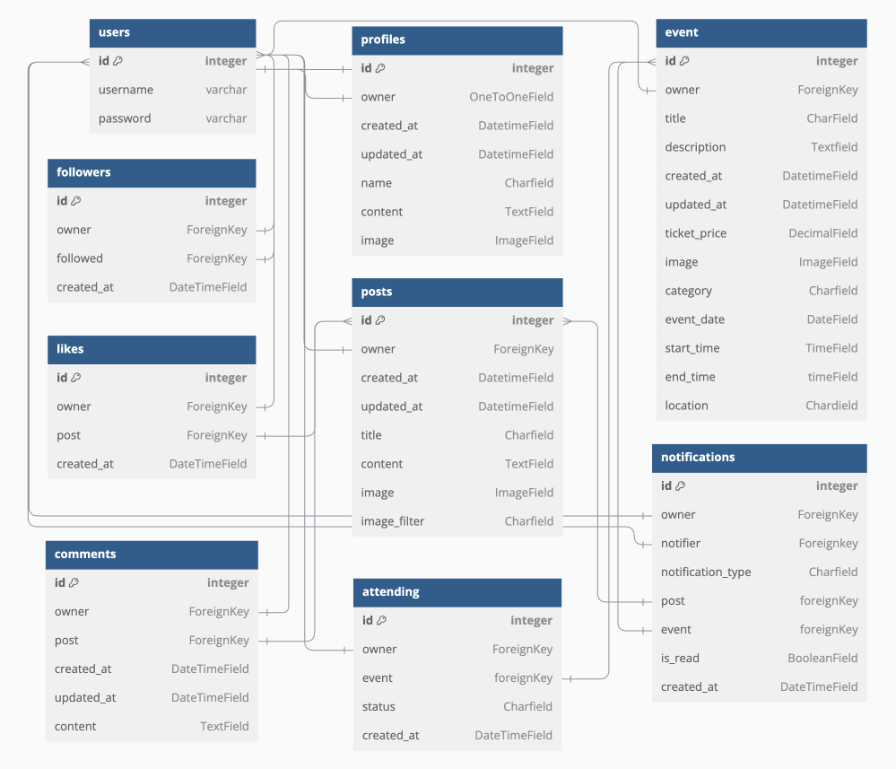

<p align="center">
  
</p>
<h1 align="center">Chronicle API - Django Rest Framework</h1>

<br>

# Project Goals

[Chronicle](https://chronicle-ci-fad840fb8771.herokuapp.com/) - Your Social Hub for Connection and Discovery

Chronicle is a vibrant social media platform that combines the best of networking and event discovery, creating a seamless space for sharing experiences, building relationships, and staying connected. Whether you're here to connect with friends, explore engaging content, or discover exciting events, Chronicle empowers you to interact meaningfully and make the most of every moment.

## Key Features:
- **Discover and Engage:**
  - View posts from the community and interact by liking, commenting, and following users.
  - Stay updated with a personalized feed showcasing posts from people you follow.

- **Events Management:**
  - Explore a dedicated Events Page to find events created by users.
  - Mark your attendance status as Attending or Interested to stay involved.
  
- **User Profiles:**

  - Every user has a detailed profile showcasing their posts, events, followers, and followings.
  - Profile pictures and activity stats make it easy to connect and learn more about others.

- **Real-Time Notifications:**

  - Get notified when someone likes or comments on your posts, follows you, or interacts with your events.


## Planning

### Project Overview
Chronicle is a dynamic social media platform designed to foster connections, share experiences, and explore events. It enables users to sign up, create posts and events, interact with a personalized feed, follow other users, and discover exciting community events. 

The project is powered by a Django backend with a REST API, paired with a responsive React frontend. Key features include user authentication, a content discovery system, a dedicated events page, and real-time notifications to keep users engaged.

### Objectives
1. Develop a secure and scalable backend API using Django and Django REST Framework.
2. Create an intuitive and interactive frontend using React.
3. Implement user authentication and profile management.
4. Build a feed system that showcases posts from followed users.
5. Develop a robust events management system, allowing users to browse, create, and interact with events.
6. Implement a notification system to alert users of interactions such as likes, comments, or new followers.
7. Ensure the platform supports responsive design, delivering a seamless experience across devices.

# Data Models

The data models for this website are designed to create a cohesive and interconnected system that supports a dynamic platform for user interactions, event and post management, and content sharing. These models provide the foundation for key features such as user notifications, social interactions (likes, comments, followers), event attendance, and content-based activities. Together, they form a robust architecture that caters to both the functional and social needs of the application.

## **Database Schema**
The database schema leverages Django's ORM (Object-Relational Mapping) to establish a reliable and scalable structure. It encompasses built-in Django models along with custom-defined models tailored to the specific requirements of the platform. The schema emphasizes efficiency, maintainability, and clarity, ensuring that data relationships are optimized for seamless functionality across features.

Key entities in the schema include:

- **User-related Models:** Manage user profiles, social interactions (e.g., following), and notification preferences.
- **Content-based Models:** Handle posts, likes, comments, event creation, and attendance tracking
- **Notifications:** Delivering real-time updates for likes, comments, follows, and event attendances.

### **Entity Relationship Diagram (ERD**)
The ERD visually maps out the relationships and dependencies among various entities in the system. It provides a clear representation of how users interact with posts, events, and other users, while also highlighting the notification and social engagement processes. This diagram acts as a blueprint for developers, making it easier to understand the data flow and identify key relationships within the application. [dbdiagram.io](https://dbdiagram.io) was utilized to design the ERD.



## **Technical Architecture**
The data models in Chronicle are designed with scalability, modularity, and efficiency at their core, leveraging Django's ORM to streamline data handling and interactions. The architecture ensures a robust and well-structured system that supports Chronicle’s features, including social interactions, notifications, and event management.


#### **Core Design Principles**

1. **Modularity**: The architecture is divided into distinct modules, such as Users, Profiles, Posts, Notifications, Events, and Interactions(likes, comments, attendings), each responsible for a specific domain of functionality.
2. **Relational Integrity**: By utilizing Django’s relational database capabilities, the models enforce strict foreign key relationships, ensuring data consistency and integrity across the system.
3. **Extensibility**: The schema is built to accommodate future features without major refactoring, enabling the platform to grow organically.
4. **Optimized Performance**: Indexing of commonly queried fields and efficient query design help reduce latency and improve scalability as the user base grows.

<br>

## **Key Model Relationships**

- Users:
  - **Profile**: Extends the default Django User model with additional fields for personalization.
  - **Followers**: Creates a many-to-many relationship, enabling users to follow and unfollow one another, fostering a social network.

- Posts:
  - **User-generated content**: Posts include text, images, and multimedia to encourage user engagement.
  - **Likes and Comments**: Linked to Likes and Comments for user interaction with posts, enabling likes and threaded discussions.
  - **Notifications**: Post interactions trigger notifications, keeping users updated on likes, comments, and more.
  - **Timestamps**: Tracks creation and update times, ensuring content freshness.

- Followers
  - **User Connections**: Manages who follows whom by using two ForeignKey fields, creating a many-to-many relationship between users.
  - **Notifications**: Following users triggers notifications, alerting new followers and activity.
  - **Dynamic Relationship**: Users can follow and unfollow at any time, with real-time updates.

- Notifications:
  - **Event-Driven**: Triggered by user actions (likes, comments, follows, event participation) to keep users informed.
  - **Notification Types**: Flexible notification_type field allows new notification types to be added easily.
  - **User-Centric**: Notifications are linked to users, ensuring personalized updates.

- Events:
  - **User-Generated**: Users create events for social gatherings, online meetups, etc.
  - **RSVP & Status**: Tracks participation with statuses like "interested" or "attending" via the Attending model.
  - **Notifications**: Event updates trigger notifications to participants and hosts.
  - **Timestamps**: Events have start and end times to track scheduling.

- Interactions
  - **Likes, Comments & Attendings**: Users interact with posts and events through likes, comments, and attending statuses.
  - **Nested Comments**: Supports threaded comments for deeper discussions.
  - **Dynamic Updates**: Interactions update in real-time, with notifications for new likes, comments, followers or event RSVP's.

<br>

### **Entity Relationships Overview:**
- **One-to-One:** Each user profile is uniquely tied to a Django User model instance.
- **One-to-Many:** 
  - Users can create multiple posts, comments, likes, or events.
  - Posts can have multiple comments and likes.
- **Many-to-Many:**
  - Follower relationships enable users to connect with each other.
  - Event attendance is facilitated through intermediary models.

<br>  

<u>Comprehnsive Relationship Table</u>

| Primary Model |  Related Model | Relationship Type | Description |
|---------|---------|----------|------------------|
| User | Profile | One-to-One | Each user has one profile. |
| User | Post | One-to-Many | One user can create multiple posts. |
| User | Event | One-to-Many | One user can create multiple events. |
| User | Comment | One-to-Many | One user can create multiple comments. |
| User | Like | One-to-Many | One user can like many posts. |
| User | Attendings | One-to-Many | One user can attend multiple Events. |
| User | Follower | Many-to-Many | Users can follow each other. |
| Post | Like | One-to-Many | A post can have many likes. |
| Post | Comment | One-to-Many | A post can have many comments. |
| Event | Attendings | Many-to-Many | Events can have multiple participants. |
| Notification | User | Many-to-One | Many Notifications belong to one users |
| Notification | Post | Many-to-One | Many Notifications belong can be associated with one post |
| Notification | Events | Many-to-One | Many Notifications belong can be associated with one event |

<br>

#### **Validation and Constraints**

Custom validation methods ensure logical consistency within the models:

- **Notifications**: Require associated posts or events based on notification_type, ensuring notifications are only triggered when valid entities exist.
- **Events**: Enforce date and participant constraints.
- **Followers, Likes, and Attendings**: Use 'unique_together' to prevent circular or duplicate relationships.


#### **Data Flow and Dependencies**
- **Trigger-Driven Notifications:** Signals (post_save, post_delete) are used to automatically create or delete notifications based on user interactions.

<br>

## Detailed Model Descriptions

### <u>**User Model**</u>

The User model is the backbone of the Chronicle application, handling authentication, user identity, and management with security and scalability in mind. Built into Django, it ensures robust functionality and integrates seamlessly with custom extensions like the Profile model.

**Key Features:**
1. **Authentication**: Manages user credentials and ensures secure access to the platform.
2. **Permissions and Roles**: Supports user roles (e.g., admin, staff) and permission settings.
3. **Scalability**: Designed to handle thousands of users with high efficiency.
4. **Extensibility**: Can be extended using one-to-one relationships (e.g., Profile) for additional fields.

**Implementation Notes:**

- Provides a solid foundation for user-specific features, including permissions and personalized experiences.
- Passwords are securely hashed using Django’s built-in hashing system, ensuring safe storage.

**Advantages:**

- **Security**: Out-of-the-box secure login and password management.
- **Flexibility**: Can be customized or extended as needed.
- **Integration**: Natively integrates with Django’s authentication system.

The User model serves as a cornerstone, supporting authentication, user-specific content, and other domain-specific functionalities.

### <u>**Profile Model**</u>

The `Profile` model extends the `User` model, adding personalization and enabling users to share more about themselves, enhancing engagement across the platform.

**Key Features:**

1. **One-to-One Relationship:** Directly linked to the `User`, each profile is unique to an account.
2. **Custom Fields**: Includes fields like name, content(bio), and image for personalization.
3. **Timestamps**: Tracks profile creation and updates for auditing and versioning.

**Fields**:

| Field | Attribute | Description |
|-------|-----------|-------------|
|id|BigAutoField|Unique identifier for each profile|
|owner|	OneToOneField|Links the profile to a unique user.|
|created_at|DateTimeField|Timestamp for when the profile was created.|
|updated_at|DateTimeField|Tracks the most recent profile updates.|
|name|CharField|User-selected nickname, displayed across the platform.|
|content|TextField|Optional bio or description for personalization.|
|image|ImageField|Profile picture for visual identification.|


**Advantages:**
- **Flexibility**: Can be easily expanded to include additional user attributes.

The Profile model complements the User model by handling personalized data and extending functionality.

### <u>**Posts Model**</u>

The Posts model powers user-generated content, forming the heart of social interaction within the Chronicle app.

**Key Features:**

1. **Ownership**: Links each post to its creator, ensuring accountability.
2. **Rich Media Support**: Allows image uploads and optional filters for customization.
3. **Community Engagement:** Enables likes, comments, and sharing functionality.
4. **Timestamps**: Tracks creation and updates to ensure relevance.

**Fields:**

| Field | Attribute | Description |
|-----------------|--------------|--------------|
| id | BigAutoField | Unique identifier for each post. |
| owner | ForeignKey | Links the post to its creator.|
| created_at | DateTimeField| Timestamp for when the post was created. |
| updated_at | DateTimeField| Tracks the most recent updates to the post. |
| title | CharField | A brief, descriptive title summarizing the post. |
| content | TextField | The main content of the post. |
| image | ImageField | Optional image associated with the post. |
| image_filter | CharField | Optional filter applied to the image. |


The Posts model fosters user engagement by supporting rich, interactive content.


### <u>**Comments Model**</u>

The Comments model enables users to discuss and share feedback on posts.

**Key Features:**

1. **Threaded Conversations**: Supports replies and discussions within posts.
2. **Ownership**: Links comments to their authors and related posts.
3. **Timestamps**: Tracks comment creation and edits.

**Fields:**

| Field | Attribute | Description |
|-------|-----------|-------------|
| id | BigAutoField  | Unique identifier for each comment. |
| owner | ForeignKey | Links the comment to its author. |
| created_at | DateTimeField | Timestamp for when the comment was created. |
| updated_at | DateTimeField | Tracks updates to the comment. |
| post | ForeignKey | Connects the comment to its parent post. |
| content | TextField | Main text of the comment. |

The Comments model fosters communication, building vibrant discussions around user-generated content.


### <u>**Likes Model**</u>

The Likes model tracks user appreciation for posts.

**Key Features:**

1. **Action Tracking:** Logs which users liked specific posts.
2. **Analytics**: Provides metrics for user engagement.

**Fields:**

| Field       | Attribute    | Description |
|-------------|--------------|----------------|
| id | BigAutoField | Unique identifier for each like. |
| owner | ForeignKey | User who liked the post. |
| post | ForeignKey | Targeted post. |

The Likes model is simple but essential for measuring user interaction.


### <u>**Events Model**</u>

The Events model powers the creation, management, and promotion of events within the Chronicle app.

**Key Features:**

1. **Event Hosting**: Allows users or admins to create and host events.
2. **Participation Tracking**: Links to the Attendings model for managing attendees.
3. **Rich Descriptions**: Includes details like location, time, and description to enhance user understanding.

**Fields:**

| Field        | Attribute      | Description |
|--------------|----------------|------------|
| id | BigAutoField | Unique identifier for each event. |
| owner | ForeignKey | Creator or host of the event. |
| title | CharField | Title of the event. |
| description | TextField | Detailed description of the event. |
| location | CharField | Venue or location of the event. |
| start_time | TimeField | Event start date and time. |
| end_time | TimeField | Event end date and time. |
| image | ImageField | Optional promotional image for the event. |
| created_at | DateTimeField | Timestamp for when the event was created. |
| updated_at | DateTimeField | Tracks the most recent updates to the event. |

The Events model serves as a hub for gathering users and building an active community.


### <u>**Attendings Model**</u>

The Attendings model tracks user participation in events, ensuring a streamlined system for managing attendees.

**Key Features:**

1. **Event Tracking**: Links users to events they attend.
2. **Ownership**: Ensures each attendance record is associated with a specific user and event.
3. **Time Tracking**: Records when a user marks attendance for an event.

**Fields:**

| Field       | Attribute      | Description |
|-------------|----------------|-------------|
| id | BigAutoField | Unique identifier for each attendance record. |
| owner | ForeignKey | User attending the event. |
| event | ForeignKey | Event that the user is attending. |
| created_at  | DateTimeField  | Timestamp for when the attendance record was created. |

**Advantages:**

- **Scalable**: Supports managing large numbers of attendees across multiple events.
- **Insightful**: Helps event organizers track attendance trends.

The Attendings model ensures seamless tracking of user participation in events, driving community engagement.


### <u>**Followers Model**</u>
The Followers model enables social connectivity by allowing users to follow others, fostering a sense of community.

**Key Features:**

1. **Relationship Management**: Tracks "following" and "follower" relationships.
2. **User Engagement**: Encourages networking and interaction through follow notifications.

**Fields:**


| Field       | Attribute      | Description |
|-------------|----------------|-------------|
| id | BigAutoField | Unique identifier for each follow record. |
| owner | ForeignKey | User who is following another user.|
| follwed | ForeignKey | User who is being followed. |
| created_at | DateTimeField  | Timestamp for when the follow relationship was created. |

**Advantages:**

- **Community Building**: Promotes connections and strengthens user relationships.
- **Personalized Feeds**: Enables content curation based on followed users.


The Followers model is a cornerstone for social interaction, driving engagement through connections.

### <u>**Notification Model**</u>
The Notification model tracks user activity, ensuring important events are highlighted and delivered efficiently.

**Key Features:**

1. **Action Tracking**: Logs actions like likes, comments, interests, attendings and follows.
2. **Ownership**: Each notification is tied to its recipient and originator.
3. **Status Management**: Differentiates between read and unread notifications.

**Fields:**

| Field | Attribute | Description |
|-------|-----------|-------------|
| id | BigAutoField | Unique identifier for each notification. |
| owner | ForeignKey | Recipient of the notification. |
| notifier | ForeignKey | User who triggered the notification. |
| notification_type | CharField | Action type (e.g., like, comment, follow). |
| post | ForeignKey | Optional link to a related post. |
| event | ForeignKey | Optional link to a related event. |
| is_read | BooleanField | Indicates if the notification has been read. |
| created_at | DateTimeField | Timestamp for when the notification was generated. |

**Advantages**:

- **Engagement**: Ensures users stay informed about platform activity.
- **Organization**: Centralizes user interactions for better accessibility.


# API Endpoints

This section outlines the RESTful `API endpoints` for the Chronicle app. Each endpoint is categorized based on the corresponding app or functionality, detailing the HTTP methods, URLs, and descriptions of the available operations.


### Root API Endpoint
The Root API endpoint provides an entry point to the application and returns a message.

| Method | Endpoint  | Description |
|--------|-----------|-------------|
| GET    | `/`         | Returns general Root route, with message: "welcomes to the Chronicle API" |


### User API Endpoints

Endpoints related to user authentication, registration, and management.

| Method  | Endpoint | Description |
|---------|----------------------|------------------------------|
| GET     | `/admin/`                      | Django admin interface |
| POST    | `/dj-rest-auth/login/`        | User login |
| POST    | `/dj-rest-auth/logout/`       | Log out the current user and invalidate their token. |
| GET     | `/dj-rest-auth/user/`         | Retrieve details of the authenticated user. |
| PUT     | `/dj-rest-auth/user/`         | Update current user details. |
| POST    | `/dj-rest-auth/registration/` | User registration. |


### Profile API Endpoints

Endpoints to manage user profiles.

| Method  | Endpoint | Description |
|---------|-----------------------|--------------------|
| GET     | `/profiles/`          | List all profiles. |
| GET     | `/profiles/<id>/`     | Retrieve the details of a specific profile by ID. |
| PUT     | `/profiles/<id>/`     | Update a specific profile (requires authorization). |
| PATCH    | `/profiles/<id>/` | Upload or update the profile image for a user. |


### Post API Endpoints

Endpoints for creating, reading, updating, and deleting posts.

| Method  | Endpoint              | Description |
|---------|-----------------------|------------------------------------------|
| GET     | `/posts/`             |  Retrieve a list of all posts. |
| POST    | `/posts/`             | Create a new post. |
| GET     | `/posts/<id>/`        | Retrieve details of a specific post. |
| PUT     | `/posts/<id>/`        | Update a specific post (requires ownership). |
| DELETE  | `/posts/<id>/`        | Delete a specific post (requires ownership). |


### Comment API Endpoints

Endpoints to handle comments on posts.

| Method  | Endpoint              | Description |
|---------|-----------------------|-------------------------------------------|
| GET     | `/comments/`            | Retrieve a list of all comments. |
| POST    | `/comments/`            | Create a new comment on a post. |
| GET     | `/comments/<id>/`       | Retrieve details of a specific comment. |
| PUT     | `/comments/<id>/`       | Update a specific comment (requires ownership). |
| DELETE  | `/comments/<id>/`       | Delete a specific comment (requires ownership). |          


### Like API Endpoints

Endpoints for liking or unliking posts.

| Method  | Endpoint              | Description |
|---------|-----------------------|-------------------------------------|
| Get    | `/likes/`               | List all likes. |
| POST   | `/likes/`               | Like a post (requires post ID in request body). |
| Get    | `/likes/<id>/`          | Retrieve a specific like |
| DELETE  | `/likes/<id>/`         | Remove a specific like (requires ownership). |


### Followers API Endpoints

Endpoints for managing "following" relationships between users.

| Method  | Endpoint              | Description |
|---------|-----------------------|--------------------------------|
| GET     | `/followers/`           | Retrieve a list of all followers. |
| POST    | `/followers/`           | Follow a user (requires followed user ID in request body). |
| GET     | `/followers/<id>`       | Retrieve a follower relationship. |
| DELETE  | `/followers/<id>/`      | Unfollow a user (requires ownership of the follow relationship). |


### Events API Endpoints

Endpoints to create, read, update, and delete events.

| Method  | Endpoint              | Description |
|---------|-----------------------|--------------------------------|
| GET     | `/events/`            | Retrieve a list of all events. |
| POST    | `/events/`            | Create a new event. |
| GET     | `/events/<id>/`       | Retrieve details of a specific event. |
| PUT     | `/events/<id>/`       | Update a specific event (requires ownership). |
| DELETE  | `/events/<id>/`       | Delete a specific event (requires ownership). |


### Attendings API Endpoints

Endpoints to manage attendance for events.

| Method  | Endpoint              | Description |
|---------|-----------------------|-----------------------------|
| GET     | `/attendings/`          | Retrieve a list of all attendings. |
| POST    | `/attendings/`          | Mark attendance for an event (requires event ID in request body). |
| GET     | `/attendings/`          | Retrieve a specific attendings model. |
| Put     | `/attendings/<id>/`     | Update attendings status (requires ownership). |
| DELETE  | `/attendings/<id>/`     | Remove an attendance record (requires ownership). |


### Notifications API Endpoints

Endpoints to manage user notifications.

| Method  | Endpoint                | Description |
|---------|-------------------------|----------------------------------------------------------------------------|
| GET     | `/notifications/`                 | Retrieve a list of all notifications for the authenticated user.          |
| GET     | `/notifications/<id>/`            | Retrieve details of a specific notification by ID.                        |
| PUT     | `/notifications/mark-all-as-read/`| Mark all notifications as read.                                      |
| DELETE  | `/notifications/<id>/`            | Delete a specific notification by ID.                                      |
| POST    | `/notifications/`                 | Create a new notification (usually triggered by specific events in the app). |

<br>

# Frameworks, Libraries, and Dependencies

The project leverages a robust stack of frameworks and libraries to provide efficient, scalable, and feature-rich functionality. Below is a detailed list of the major frameworks and dependencies used:

### Core Frameworks
- **Django** (v3.2.25): A high-level Python web framework that simplifies the development of secure and scalable web applications.
- **Django REST Framework** (v3.12.4): A powerful and flexible toolkit for building Web APIs.
- **Django Allauth** (v0.54.0): Integrated tools for handling user authentication, registration, and account management.

### API and Authentication
- **dj-rest-auth** (v2.1.9): Provides a RESTful API for Django authentication, including features like login, registration, and password management.
- **Djangorestframework-simplejwt** (v5.3.1): Implements JSON Web Token (JWT) authentication for secure API access.
- **OAuthlib** (v3.2.2) & Requests-OAuthlib (v2.0.0): Libraries used for handling OAuth flows for third-party authentication.

### Cloud Services
- **Cloudinary**(v1.41.0): Enables easy management of image and video uploads to the cloud.
- **Django-Cloudinary-Storage** (v0.3.0): Facilitates the integration of Cloudinary as the default media storage backend for Django applications.

### Database and ORM
- **dj-database-url** (v0.5.0): Simplifies database configuration from a single URL.
- **psycopg2** (v2.9.10): A PostgreSQL adapter for Python, providing efficient interaction with PostgreSQL databases.
- **SQLParse** (v0.5.1): A non-validating SQL parser used internally by Django.

### Utilities
- **Django Filter** (v2.4.0): Provides easy filtering options for querying data in Django REST APIs.
- **Django CORS Headers** (v4.5.0): Handles Cross-Origin Resource Sharing (CORS) requests, ensuring secure interaction between frontend and backend systems.
- **Pillow** (v11.0.0): A Python Imaging Library (PIL) fork used for handling image processing tasks like resizing and formatting.
- **Pytz** (v2024.2): Adds support for accurate and up-to-date timezone handling.
- **Setuptools** (v69.5.1): Simplifies the process of packaging and distributing Python projects.
- **asgiref** (v3.8.1): Provides asynchronous server gateway interface (ASGI) support, enabling real-time features and efficient request handling.

### Deployment
- **Gunicorn** (v23.0.0): A Python WSGI HTTP server for running the application in production environments.
Asynchronous Support


# Testing and Validation

For all testing and validation, please refer to the [TESTING.md](TESTING.md) file.


# Bugs

### Fixed


1. Fix for Duplicate Notifications in `signals.py`

- **Location**:
`Notification/signals.py`, responsible for automatically creating notifications for relevant model changes.

- **Problem**: Attendance notifications could be duplicated if the same notifier updated their status for the same event multiple times, leading to redundant entries.

- **Solution**: In the `create_update_attendance_notification` signal handler:
  - Added a filter to delete any existing notifications for the same notifier, event, and status before creating a new one.
  - This ensures only one notification exists per notifier and event at any given time.


### Not Fixed

1. In the **EventSerializer**, the `to_representation` method customizes how the `event_date` and `ticket_price` are displayed.

- **Problem**: The custom formatting for `event_date` and `ticket_price` causes issues when trying to update an event (via a PUT request) in both the backend development database and the frontend form:

  - `event_date` is formatted as 'DD MMM YYYY' for display but is not converted back to the expected format (YYYY-MM-DD) when updating.
  - `ticket_price` is displayed as "Free" if it's 0.00, which doesn't match the expected format for the backend.

This mismatch results in fields not being properly prefilled in the frontend and rejected updates in the backend.

**Relevant Code**:
```python
def to_representation(self, instance):
        """
        Override the default `to_representation` method to:
        Format how ticket_price is represented.
        Format start_time, end_time, and event_date.
        """
        representation = super().to_representation(instance)

        # Format event_date to 'DD MMM YYYY'
        representation['event_date'] = (
            instance.event_date.strftime("%d %b %Y")
            if instance.event_date
            else None
        )

        # Modify the ticket_price field
        if instance.ticket_price == 0.00:
            representation['ticket_price'] = "Free"
        else:
            representation['ticket_price'] = f"€{instance.ticket_price:.2f}"

        return representation
```

# Future Features

1. **Enhanced Location Filtering:**
Introduce a structured location input (e.g., separate fields for country and city) to allow users to filter events more effectively based on geography.

2. **Custom Event Categories:**
Enable users to create custom event categories in addition to the predefined options, offering more flexibility for event organizers.

3. **Image Resizing:**
Implement automatic image resizing in the backend to allow users to upload any image size, while ensuring that images are optimized for storage and performance without sacrificing quality.

4. **Favorites System:**
Add a feature for users to mark events as favorites for easy access later.

6. **Event Sharing:**
Provide integration for sharing events on social media platforms or via direct links.

7. **Advanced Search and Filtering:**
Expand search capabilities with filters like date ranges, ticket prices, and event popularity.


# Deployment

The live link can be found here - [**Chronicle-API**](https://chronicle-api-8dba6c70f37d.herokuapp.com/)

The [**Chronicle app**](https://chronicle-api-8dba6c70f37d.herokuapp.com/) uses the following tools and services to streamline its development, deployment, and ongoing management:

### **GitHub**:
A version control system that hosts the project repository, enabling efficient code management and collaboration among developers.

### **GitPod**:
A cloud-based integrated development environment (IDE) that provides a preconfigured workspace for coding and testing, ensuring a consistent and accessible development environment.

### **CI Database** (PostgreSQL): 
The Code Institute provides PostgreSQL-based database systems for students, offering reliable data storage and management during development and deployment. It supports advanced features like indexing, transactions, and concurrency, ensuring high performance and seamless integration with web frameworks like Django. The database offers a stable environment for students to develop and manage real-world applications.

### **Heroku**: 
A cloud platform as a service (PaaS) for hosting and deploying the application, offering automatic scaling, deployment, and management tools to ensure smooth application performance.

__Steps for deployment with Heroku__:

1. **Log into Heroku**: Navigate to the Heroku website and log into your account to access the dashboard.
2. **Create a New App**: Click the "New" button in the top-right corner and select "Create New App" from the dropdown menu.
3. **Give the App a Unique Name**: Choose a unique name for your app that will be used as part of the URL.
4. **Select Your Region**: Choose the preferred region for your app, either "United States" or "Europe", from the dropdown menu.
5. **Create the App**: After naming your app and selecting the region, click the "Create App" button to create the app.
6. **Connect to GitHub**: In the app’s dashboard, go to the "Deploy" tab, scroll down to "Deploy Method", and select GitHub as the source. Connect your GitHub repository with Heroku.
7. **Go to Settings**: Navigate to the "Settings" tab in the top menu.
8. **Set Up Environment Variables**: Under the "Config Vars" section, click the "Reveal Config Vars" button and add the following keys and values:
- `SECRET_KEY`: The secret key for your Django project.
- `DATABASE_URL`: The URL for your database (e.g., Heroku Postgres).
- `CLOUDINARY_URL`: The URL for your Cloudinary account (for media storage).
9. **Enable Automatic Deploys**: In the "Deploy" section, enable automatic deploys from your GitHub repository. This will allow Heroku to automatically update your app whenever new changes are pushed to the repository.
10. **Manual Deployment**: In case of manual deployment, choose the specific `branch` (e.g., main) of your GitHub repository that you want to deploy. Afterwards, click on the`Deploy Branch* button,

11. **Open the App:** Once the deployment process is complete, click the "View" button to open the link to your live app.

**For deployment, Heroku needs two additional files in order to deploy properly.**
- **requirements.txt**:
    - You can update the requirements file after installing more packages with the command:
    ```bash
    pip3 freeze --local > requirements.txt
    ```
    - You can install this project'S requirements using:
    ```bash
    pip3 install -r requirements.txt
    ```

- **Procfile**, which can be created with the following steps:
    1. echo web: gunicorn app_name.wsgi > Procfile
    2. replace app_name with the name of your primary Django app name; the folder where settings.py is located


### **Cloudinary**:
To improve performance and scalability, the project uses Cloudinary for hosting media files like images. This offloads the task of serving static content from Heroku, optimizing both storage and delivery.

Integration Steps:

- Create a Cloudinary account and configure API keys in Django settings.
- Use Django's storage backend to manage media uploads.

By leveraging Cloudinary, the project ensures faster, more efficient media handling, while supporting future growth with a scalable solution.


# Credits

## Code:

During the development of the Chronicle API application, several valuable resources were used for inspiration and knowledge:

- [**Django Signals Documentation**](https://docs.djangoproject.com/en/5.1/ref/signals/)
- [**DRF Documentation**](https://www.django-rest-framework.org/)
- [**Stackoverflow:**](https://stackoverflow.com/) Utilized for finding solutions and troubleshooting errors encountered during development.


## Media

Media elemets for the site were gathered, managed, and edited using the following platforms:

- [logo:](https://logo.com/) Used to create the site's logo.
- [dbdiagram:](https://dbdiagram.io/d) to design site's database schema (ERD).


# Acknowlegements

The development of the Chronicle API has been a rewarding journey, and I am deeply appreciative of the valuable resources, support, and inspiration that have played a crucial role in bringing this project to life.

### Inspiration
The Chronicle API project draws inspiration from the following sources:

- **Code Institute's "Django Rest Framework" Walkthrough Project:**
This resource provided a crucial foundation for building the API. It helped me understand the principles of building a RESTful API using Django Rest Framework (DRF), including serialization, authentication, and endpoints. The walkthrough was key in setting up the core structure of the API and understanding best practices for backend development.
It provided the essential features such as user profiles, posts, comments, likes, and followers. 

- **Code Institute's "Moments" Walkthrough Project:** While this was primarily used as a reference for the front-end, the concepts and structure from Moments also inspired some of the API endpoints and how data is managed and structured for the Chronicle API.

### Project Guidance

- My Code Institute mentor, Juliia Konovalova, for her guidance.

- Kristyna, our facilitator at Code Institute , for her constant support and positivity.

- My classmates for their inspiration and help when things got tough.

