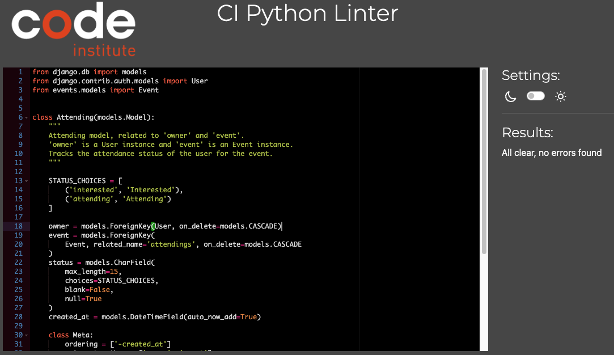
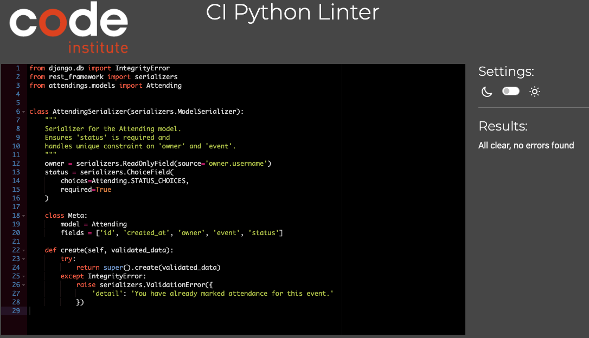
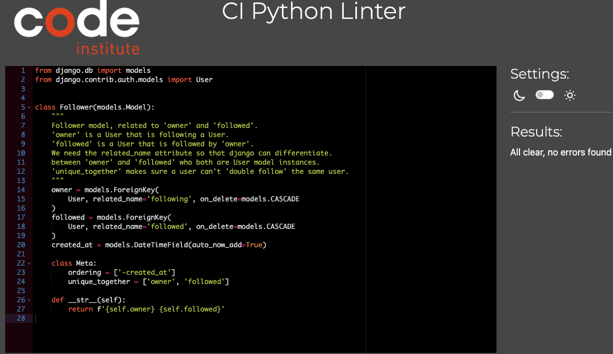

## Manual Testing

The following tables provides the results of manual testing conducted on various API endpoints for the application. Each endpoint was tested for functionality, expected behavior, and the response provided by the API. The testing process involved verifying the authentication flow, profile management, and other essential features exposed by the API.

### Admin and Authentication Endpoints

| Endpoint | Method | Expected Result | Result | 
|----------|--------|-----------------|--------|
| `/admin/` | GET | Access the Django admin interface. | Pass |
| `/dj-rest-auth/logout/` | POST | Logs out the user and invalidates their token. | Pass |
| `/dj-rest-auth/login/` | POST | Returns tokens after successful login.  | Pass |
| `/dj-rest-auth/user/` | GET | Retrieves authenticated user details.   | Pass |
| `/dj-rest-auth/user/` | PUT | Updates authenticated user details.   | Pass |
| `/dj-rest-auth/registration/` | POST | Registers a new user and returns their details.  | Pass |

### Profiles Endpoints

| Endpoint | Method | Expected Result | Result | 
|----------|--------|-----------------|--------|
| `/profiles/` | GET | Lists all profiles. | Pass |
| `/profiles/<id>/` | GET | Retrieves specific profile details by ID. | Pass |
| `/profiles/<id>/` | PUT | Updates a profile (requires authorization). | Pass |
| `/profiles/<id>/` | PATCH | Uploads or updates a profile image. | Pass |

### Posts Endpoints 

| Endpoint | Method | Expected Result | Result | 
|----------|--------|-----------------|--------|
| `/posts/` | GET | Retrieve all posts. | Pass |
| `/posts/` | POST | Create a new post. | Pass |
| `/posts/<id>/` | GET | Retrieves details of a specific post. | Pass |
| `/posts/<id>/` | PUT | Updates a specific post (requires ownership). | Pass |
| `/posts/<id>/` | DELETE | Deletes a specific post (requires ownership). | Pass |

### Comments Endpoints 

| Endpoint | Method | Expected Result | Result | 
|----------|--------|-----------------|--------|
| `/comments/` | GET | Retrieves all comments. | Pass |
| `/comments/` | POST | Creates a new comment on a post. | Pass |
| `/comments/<id>/` | GET | Retrieves details of a specific comment. | Pass |
| `/comments/<id>/` | PUT | Updates a specific comment (requires ownership). | Pass |
| `/comments/<id>/` | DELETE | Deletes a specific comment (requires ownership). | Pass |

### Likes Endpoints 

| Endpoint | Method | Expected Result | Result | 
|----------|--------|-----------------|--------|
| `/likes/` | GET | Lists all likes. | Pass |
| `/likes/` | POST | Likes a post (post ID required). | Pass |
| `/likes/<id>/` | GET | Retrieves details of a specific like. | Pass |
| `/likes/<id>/` | DELETE | Removes a like (requires ownership). | Pass |

### Followers Endpoints

| Endpoint | Method | Expected Result | Result | 
|----------|--------|-----------------|--------|
| `/followers/` | GET | Retrieves all followers. | Pass |
| `/followers/` | POST | Follows a user (followed user ID required). | Pass |
| `/followers/<id>/` | GET | Retrieves a specific follower relationship. | Pass |
| `/followers/<id>/` | DELETE | Unfollows a user (requires ownership). | Pass |

### Events Endpoints

| Endpoint | Method | Expected Result | Result | 
|----------|--------|-----------------|--------|
| `/events/` | GET | Retrieves all events. | Pass |
| `/events/` | POST | Creates a new event. | Pass |
| `/events/<id>/` | GET | Retrieves details of a specific event. | Pass |
| `/events/<id>/` | PUT | Updates a specific event (requires ownership). | Pass |
| `/events/<id>/` | DELETE | Deletes a specific event (requires ownership). | Pass |

### Attendings Endpoints

| Endpoint | Method | Expected Result | Result | 
|----------|--------|-----------------|--------|
| `/attendings/` | GET | Retrieves all attendances. | Pass |
| `/attendings/` | POST | Marks attendance for an event. | Pass |
| `/attendings/<id>/` | GET | Retrieves details of a specific attendance. | Pass |
| `/attendings/<id>/` | PUT | Updates attendance status (requires ownership). | Pass |
| `/attendings/<id>/` | DELETE | Removes an attendance record (requires ownership). | Pass |

### Notifications Endpoints

| Endpoint | Method | Expected Result | Result | 
|----------|--------|-----------------|--------|
| `/notifications/` | GET | Retrieves all notifications for the user. | Pass |
| `/notifications/<id>/` | GET | Retrieves details of a specific notification. | Pass |
| `/notifications/` | POST | Creates a new notification. | Pass |
| `/notifications/<id>/` | DELETE | Deletes a specific notification. | Pass |
| `/notifications/mark-all-as-read/` | PATCH  | Marks all notifications as read. | Pass |

<br>

## Automated Testing 

Automated tests are a critical part of maintaining code quality and ensuring that features work as expected. In this project, automated tests were for certain applications, but not all of them. Specifically, automated tests have been written for the following apps:

- Posts
- Likes
- Events
- Attendings

However, Profiles and other components have undergone manual testing, as they do not yet have automated tests in place.

**Running Tests**

Automated tests can be executed via the Django testing framework using the following terminal command:

```bash
python manage.py test
```

This command runs all tests across the entire project, including those in any apps that have automated tests.
or 

**Running Tests for Specific Apps**

To run tests for a specific app, you can specify the app name as follows:

```bash
python manage.py test <app_name>
```

For example, to run tests only for the `Events` app, you would use:

```bash
python manage.py test events
```

### Test Results
After executing the tests, the terminal will display the results, where a series of dots (.) indicates successful tests, while any failures will be accompanied by detailed error messages explaining what went wrong.

The following image shows the results of all the automated tests:

  

### Testing Summary

**All the tests have passed**, and below is a clear definition of all the tests that were included in these files. Each test ensures that the API functions correctly under various scenarios and complies with the appropriate access control policies.

---
#### <u>**Attendings Tests**</u>

#### AttendingListViewTests
- **Retrieve Attendings List**: Verifies that the list of attendance records can be retrieved.
- **Create Attending (Logged-In User)**: Ensures authenticated users can mark themselves as attending an event.
- **Restrict Attending Creation (Unauthenticated)**: Confirms that unauthenticated users cannot create attending records.
- **Restrict Duplicate Attendings**: Validates that a user cannot mark attendance multiple times for the same event.

#### AttendingDetailViewTests
- **Retrieve Attending by ID**: Ensures an attendance record can be fetched with a valid ID.
- **Restrict Retrieval with Invalid ID**: Checks that invalid IDs return a 404 error.
- **Update Attending (Owner)**: Confirms owners can update their attendance status.
- **Restrict Update (Non-Owner)**: Verifies that non-owners cannot modify another user’s attendance.
- **Delete Attending (Owner)**: Ensures an owner can delete their attendance record.
- **Restrict Delete (Non-Owner)**: Validates that non-owners cannot delete another user’s attendance.
- **Restrict Delete (Unauthenticated)**: Ensures unauthenticated users cannot delete attendance records.

---

#### <u>**Events Tests**</u>

**EventListViewTests**
- **Retrieve Events List**: Verifies that all events can be retrieved.
- **Create Event (Logged-In User)**: Ensures authenticated users can create events.
- **Restrict Event Creation (Unauthenticated)**: Confirms that unauthenticated users cannot create events.

**EventDetailViewTests**
- **Retrieve Event by ID**: Validates that an event can be fetched with a valid ID.
- **Restrict Retrieval with Invalid ID**: Confirms that invalid IDs return a 404 error.
- **Update Event (Owner)**: Verifies that an event owner can update their event.
- **Restrict Update (Non-Owner)**: Ensures non-owners cannot modify other users’ events.
- **Delete Event (Owner)**: Confirms that the owner of an event can delete it.
- **Restrict Delete (Non-Owner)**: Verifies that non-owners cannot delete others' events.
- **Restrict Delete (Unauthenticated)**: Ensures unauthenticated users cannot delete events.

**CategoryChoicesViewTests**
- **Retrieve Event Categories**: Validates that the category choices endpoint returns valid data.

---

#### <u>**Likes Tests**</u>

**LikeListViewTests**
- **Retrieve Likes List**: Ensures the list of likes can be retrieved.
- **Create Like (Logged-In User)**: Verifies that logged-in users can like a post.
- **Restrict Duplicate Likes**: Ensures users cannot like the same post multiple times.
- **Restrict Like Creation (Unauthenticated)**: Confirms that unauthenticated users cannot like posts.

**LikeDetailViewTests**
- **Retrieve Like by ID**: Validates that a like can be fetched with a valid ID.
- **Restrict Retrieval with Invalid ID**: Confirms that invalid IDs return a 404 error.
- **Delete Like (Owner)**: Ensures an owner can delete their like.
- **Restrict Delete (Non-Owner)**: Verifies that non-owners cannot delete others' likes.
- **Restrict Delete (Unauthenticated)**: Confirms that unauthenticated users cannot delete likes.

---

#### <u>**Posts Tests**</u>

**PostListViewTests**
- **Retrieve Posts List**: Verifies that posts can be listed.
- **Create Post (Logged-In User)**: Ensures logged-in users can create posts.
- **Restrict Post Creation (Unauthenticated)**: Confirms unauthenticated users cannot create posts.

**PostDetailViewTests**
- **Retrieve Post by ID**: Validates that a post can be retrieved using a valid ID.
- **Restrict Retrieval with Invalid ID**: Confirms that invalid IDs return a 404 error.
- **Update Post (Owner)**: Ensures a post owner can update their post.
- **Restrict Update (Non-Owner)**: Confirms non-owners cannot update other users' posts.

---


## Validator Testing

### Python Validation

[PEP8 CI Linter](https://pep8ci.herokuapp.com/) provided by the Code Institute according to the PEP 8 style guide for validating the Python code.

#### drf_api - Project Module Python Validation Results

Python File | Results | Comment |
|------------|------------------------------|--------------------------------------|
|asgi.py| <details> <summary><strong>Click to View Results</strong></summary> </details> | No Errors
|permissions.py| <details> <summary><strong>Click to View Results</strong></summary> </details> | No Errors
|serializers.py| <details> <summary><strong>Click to View Results</strong></summary> </details> | No Errors
|settings.py| <details> <summary><strong>Click to View Results</strong></summary> </details> | No Errors
|urls.py| <details> <summary><strong>Click to View Results</strong></summary> </details> | No Errors
|views.py| <details> <summary><strong>Click to View Results</strong></summary> </details> | No Errors


#### Attendings - App Module Python Validation Results

Python File | Results | Comment |
|------------|------------------------------|--------------------------------------|
|admin.py| <details> <summary><strong>Click to View Results</strong></summary> </details> | No Errors
|models.py| <details> <summary><strong>Click to View Results</strong></summary> </details> | No Errors
|serializers.py| <details> <summary><strong>Click to View Results</strong></summary> </details> | No Errors
|tests.py| <details> <summary><strong>Click to View Results</strong></summary> </details> | No Errors
|urls.py| <details> <summary><strong>Click to View Results</strong></summary> </details> | No Errors
|views.py| <details> <summary><strong>Click to View Results</strong></summary> </details> | No Errors


#### Comments - App Module Python Validation Results

Python File | Results | Comment |
|------------|------------------------------|--------------------------------------|
|admin.py| <details> <summary><strong>Click to View Results</strong></summary> </details> | No Errors
|models.py| <details> <summary><strong>Click to View Results</strong></summary> </details> | No Errors
|serializers.py| <details> <summary><strong>Click to View Results</strong></summary> </details> | No Errors
|urls.py| <details> <summary><strong>Click to View Results</strong></summary> </details> | No Errors
|views.py| <details> <summary><strong>Click to View Results</strong></summary> </details> | No Errors


#### Events - App Module Python Validation Results

Python File | Results | Comment |
|------------|------------------------------|--------------------------------------|
|admin.py| <details> <summary><strong>Click to View Results</strong></summary> </details> | No Errors
|models.py| <details> <summary><strong>Click to View Results</strong></summary> </details> | No Errors
|serializers.py| <details> <summary><strong>Click to View Results</strong></summary> </details> | No Errors
|tests.py| <details> <summary><strong>Click to View Results</strong></summary> </details> | No Errors
|urls.py| <details> <summary><strong>Click to View Results</strong></summary> </details> | No Errors
|views.py| <details> <summary><strong>Click to View Results</strong></summary> </details> | No Errors


#### Followers - App Module Python Validation Results

Python File | Results | Comment |
|------------|------------------------------|--------------------------------------|
|admin.py| <details> <summary><strong>Click to View Results</strong></summary> </details> | No Errors
|models.py| <details> <summary><strong>Click to View Results</strong></summary> </details> | No Errors
|serializers.py| <details> <summary><strong>Click to View Results</strong></summary> </details> | No Errors
|urls.py| <details> <summary><strong>Click to View Results</strong></summary> </details> | No Errors
|views.py| <details> <summary><strong>Click to View Results</strong></summary> </details> | No Errors

#### Likes - App Module Python Validation Results

Python File | Results | Comment |
|------------|------------------------------|--------------------------------------|
|admin.py| <details> <summary><strong>Click to View Results</strong></summary> </details> | No Errors
|models.py| <details> <summary><strong>Click to View Results</strong></summary> </details> | No Errors
|serializers.py| <details> <summary><strong>Click to View Results</strong></summary> </details> | No Errors
|tests.py| <details> <summary><strong>Click to View Results</strong></summary> </details> | No Errors
|urls.py| <details> <summary><strong>Click to View Results</strong></summary> </details> | No Errors
|views.py| <details> <summary><strong>Click to View Results</strong></summary> </details> | No Errors


#### Notifications - App Module Python Validation Results

Python File | Results | Comment |
|------------|------------------------------|--------------------------------------|
|admin.py| <details> <summary><strong>Click to View Results</strong></summary> </details> | No Errors
|models.py| <details> <summary><strong>Click to View Results</strong></summary> </details> | No Errors
|serializers.py| <details> <summary><strong>Click to View Results</strong></summary> </details> | No Errors
|signals.py| <details> <summary><strong>Click to View Results</strong></summary> </details> | No Errors
|urls.py| <details> <summary><strong>Click to View Results</strong></summary> </details> | No Errors
|views.py| <details> <summary><strong>Click to View Results</strong></summary> </details> | No Errors


#### Posts - App Module Python Validation Results

Python File | Results | Comment |
|------------|------------------------------|--------------------------------------|
|admin.py| <details> <summary><strong>Click to View Results</strong></summary> </details> | No Errors
|models.py| <details> <summary><strong>Click to View Results</strong></summary> </details> | No Errors
|serializers.py| <details> <summary><strong>Click to View Results</strong></summary> </details> | No Errors
|tests.py| <details> <summary><strong>Click to View Results</strong></summary> </details> | No Errors
|urls.py| <details> <summary><strong>Click to View Results</strong></summary> </details> | No Errors
|views.py| <details> <summary><strong>Click to View Results</strong></summary> </details> | No Errors


#### Profiles - App Module Python Validation Results

Python File | Results | Comment |
|------------|------------------------------|--------------------------------------|
|admin.py| <details> <summary><strong>Click to View Results</strong></summary> </details> | No Errors
|models.py| <details> <summary><strong>Click to View Results</strong></summary> </details> | No Errors
|serializers.py| <details> <summary><strong>Click to View Results</strong></summary> </details> | No Errors
|urls.py| <details> <summary><strong>Click to View Results</strong></summary> </details> | No Errors
|views.py| <details> <summary><strong>Click to View Results</strong></summary> </details> | No Errors

<br>

## Bugs

### Fixed

#### 1. Attending Model Status Change Detection in Notifications:

- **Problem**: In the `notifications` app, there was an issue where changes to the `status` field of the `Attending` model (which tracks user attendance for events) were not being detected by the signal system in `signals.py`. This caused the notifications related to attendance updates to not trigger correctly when a user changed their status (e.g., from "Interested" to "Attending"). 
- **Solution** A custom `save()` method was added to the `Attending` model. This method now properly tracks changes to the `status` field by setting a flag (`_status_changed`) so that the notification system can update accordingly.

#### 2. Duplicate Notifications in `signals.py`
- **Problem**: Attendance notifications were being duplicated when the same notifier updated their status repeatedly for the same event, causing redundant notifications.
- **Solution**:
    - Updated the `create_update_attendance_notification` signal handler in `Notification/signals.py`.
    - Added logic to filter and delete existing notifications for the same notifier, event, and status before creating a new notification.
    - This ensures that at any given time, there is only one notification for a notifier and event combination.
____
### Not Fixed

#### 1. Ticket Price Representation Causes Frontend Mismatch

- **Problem**: The backend uses a custom `to_representation` method in the `EventSerializer` to display `ticket_price`. When the price is `0.00`, it is represented as `"Free"`. This causes issues when the frontend tries to prefill the input fields (especially for numeric values) as the backend format (`"Free"`) does not match the expected numeric format in the form.

#### 2. Admin Panel Styling Issues

- **Issue**: Despite configuring `settings.py` correctly, I was unable to collect admin panel styling using `collectstatic`.
- **Challenges**: The issue likely relates to static file handling or caching. For now, I decided to prioritize other tasks over resolving this issue.


Go back to [README.md](README.md)