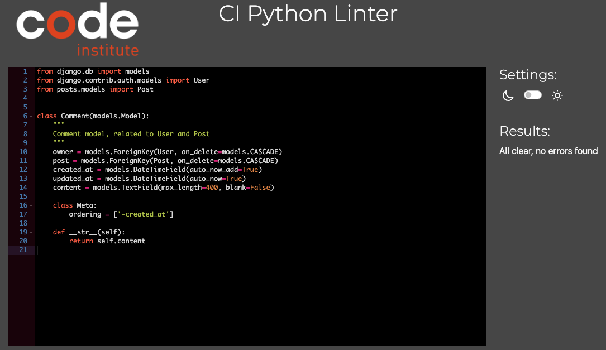

# Manual Testing

The following tables provides the results of manual testing conducted on various API endpoints for the application. Each endpoint was tested for functionality, expected behavior, and the response provided by the API. The testing process involved verifying the authentication flow, profile management, and other essential features exposed by the API.

### Admin and Authentication Endpoints

| Endpoint | Method | Expected Result | Result | 
|----------|--------|-----------------|--------|
| `/admin/` | GET | Access the Django admin interface. | Pass |
| `/dj-rest-auth/logout/` | POST | Logs out the user and invalidates their token. | Pass |
| `/dj-rest-auth/login/` | POST | Returns tokens after successful login.  | Pass |
| `/dj-rest-auth/user/` | GET | Retrieves authenticated user details.   | Pass |
| `/dj-rest-auth/user/` | PUT | Updates authenticated user details.   | Pass |
| `/dj-rest-auth/registration/` | POST | Registers a new user and returns their details.  | Pass |

### Profiles Endpoints

| Endpoint | Method | Expected Result | Result | 
|----------|--------|-----------------|--------|
| `/profiles/` | GET | Lists all profiles. | Pass |
| `/profiles/<id>/` | GET | Retrieves specific profile details by ID. | Pass |
| `/profiles/<id>/` | PUT | Updates a profile (requires authorization). | Pass |
| `/profiles/<id>/` | PATCH | Uploads or updates a profile image. | Pass |

### Posts Endpoints 

| Endpoint | Method | Expected Result | Result | 
|----------|--------|-----------------|--------|
| `/posts/` | GET | Retrieve all posts. | Pass |
| `/posts/` | POST | Create a new post. | Pass |
| `/posts/<id>/` | GET | Retrieves details of a specific post. | Pass |
| `/posts/<id>/` | PUT | Updates a specific post (requires ownership). | Pass |
| `/posts/<id>/` | DELETE | Deletes a specific post (requires ownership). | Pass |

### Comments Endpoints 

| Endpoint | Method | Expected Result | Result | 
|----------|--------|-----------------|--------|
| `/comments/` | GET | Retrieves all comments. | Pass |
| `/comments/` | POST | Creates a new comment on a post. | Pass |
| `/comments/<id>/` | GET | Retrieves details of a specific comment. | Pass |
| `/comments/<id>/` | PUT | Updates a specific comment (requires ownership). | Pass |
| `/comments/<id>/` | DELETE | Deletes a specific comment (requires ownership). | Pass |

### Likes Endpoints 

| Endpoint | Method | Expected Result | Result | 
|----------|--------|-----------------|--------|
| `/likes/` | GET | Lists all likes. | Pass |
| `/likes/` | POST | Likes a post (post ID required). | Pass |
| `/likes/<id>/` | GET | Retrieves details of a specific like. | Pass |
| `/likes/<id>/` | DELETE | Removes a like (requires ownership). | Pass |

### Followers Endpoints

| Endpoint | Method | Expected Result | Result | 
|----------|--------|-----------------|--------|
| `/followers/` | GET | Retrieves all followers. | Pass |
| `/followers/` | POST | Follows a user (followed user ID required). | Pass |
| `/followers/<id>/` | GET | Retrieves a specific follower relationship. | Pass |
| `/followers/<id>/` | DELETE | Unfollows a user (requires ownership). | Pass |

### Events Endpoints

| Endpoint | Method | Expected Result | Result | 
|----------|--------|-----------------|--------|
| `/events/` | GET | Retrieves all events. | Pass |
| `/events/` | POST | Creates a new event. | Pass |
| `/events/<id>/` | GET | Retrieves details of a specific event. | Pass |
| `/events/<id>/` | PUT | Updates a specific event (requires ownership). | Pass |
| `/events/<id>/` | DELETE | Deletes a specific event (requires ownership). | Pass |

### Attendings Endpoints

| Endpoint | Method | Expected Result | Result | 
|----------|--------|-----------------|--------|
| `/attendings/` | GET | Retrieves all attendances. | Pass |
| `/attendings/` | POST | Marks attendance for an event. | Pass |
| `/attendings/<id>/` | GET | Retrieves details of a specific attendance. | Pass |
| `/attendings/<id>/` | PUT | Updates attendance status (requires ownership). | Pass |
| `/attendings/<id>/` | DELETE | Removes an attendance record (requires ownership). | Pass |

### Notifications Endpoints

| Endpoint | Method | Expected Result | Result | 
|----------|--------|-----------------|--------|
| `/notifications/` | GET | Retrieves all notifications for the user. | Pass |
| `/notifications/<id>/` | GET | Retrieves details of a specific notification. | Pass |
| `/notifications/` | POST | Creates a new notification. | Pass |
| `/notifications/<id>/` | DELETE | Deletes a specific notification. | Pass |
| `/notifications/mark-all-as-read/` | PATCH  | Marks all notifications as read. | Pass |

<br>

# Automated Testing 

Automated tests are a critical part of maintaining code quality and ensuring that features work as expected. In this project, automated testsn were for certain applications, but not all of them. Specifically, automated tests have been written for the following apps:

- Posts
- Likes
- Events
- Attendings

However, Profiles and other components have undergone manual testing, as they do not yet have automated tests in place.

**Running Tests**

Automated tests can be executed via the Django testing framework using the following terminal command:

```bash
python manage.py test
```

This command runs all tests across the entire project, including those in any apps that have automated tests.
or 

**Running Tests for Specific Apps**

To run tests for a specific app, you can specify the app name as follows:

```bash
python manage.py test <app_name>
```

For example, to run tests only for the `Events` app, you would use:

```bash
python manage.py test events
```

### Test Results
After executing the tests, the terminal will display the results, where a series of dots (.) indicates successful tests, while any failures will be accompanied by detailed error messages explaining what went wrong.

The following image shows the results of all the automated tests:


# Validator Testing

## Python Validation

[PEP8 CI Linter](https://pep8ci.herokuapp.com/) provided by the Code Institute according to the PEP 8 style guide for validating the Python code.

### drf_api - Project Module Python Validation Results

Python File | Results | Comment |
|------------|------------------------------|--------------------------------------|
|asgi.py| <details> <summary><strong>Click to View Results</strong></summary> </details> | No Errors
|permissions.py| <details> <summary><strong>Click to View Results</strong></summary> </details> | No Errors
|serializers.py| <details> <summary><strong>Click to View Results</strong></summary> </details> | No Errors
|settings.py| <details> <summary><strong>Click to View Results</strong></summary> </details> | No Errors
|urls.py| <details> <summary><strong>Click to View Results</strong></summary> </details> | No Errors
|views.py| <details> <summary><strong>Click to View Results</strong></summary> </details> | No Errors


### Attendings - App Module Python Validation Results

Python File | Results | Comment |
|------------|------------------------------|--------------------------------------|
|admin.py| <details> <summary><strong>Click to View Results</strong></summary> </details> | No Errors
|models.py| <details> <summary><strong>Click to View Results</strong></summary> </details> | No Errors
|serializers.py| <details> <summary><strong>Click to View Results</strong></summary> </details> | No Errors
|tests.py| <details> <summary><strong>Click to View Results</strong></summary> </details> | No Errors
|urls.py| <details> <summary><strong>Click to View Results</strong></summary> </details> | No Errors
|views.py| <details> <summary><strong>Click to View Results</strong></summary> </details> | No Errors


### Comments - App Module Python Validation Results

Python File | Results | Comment |
|------------|------------------------------|--------------------------------------|
|admin.py| <details> <summary><strong>Click to View Results</strong></summary> </details> | No Errors
|models.py| <details> <summary><strong>Click to View Results</strong></summary> </details> | No Errors
|serializers.py| <details> <summary><strong>Click to View Results</strong></summary> </details> | No Errors
|urls.py| <details> <summary><strong>Click to View Results</strong></summary> </details> | No Errors
|views.py| <details> <summary><strong>Click to View Results</strong></summary> </details> | No Errors


### Events - App Module Python Validation Results

Python File | Results | Comment |
|------------|------------------------------|--------------------------------------|
|admin.py| <details> <summary><strong>Click to View Results</strong></summary> </details> | No Errors
|models.py| <details> <summary><strong>Click to View Results</strong></summary> </details> | No Errors
|serializers.py| <details> <summary><strong>Click to View Results</strong></summary> </details> | No Errors
|tests.py| <details> <summary><strong>Click to View Results</strong></summary> </details> | No Errors
|urls.py| <details> <summary><strong>Click to View Results</strong></summary> </details> | No Errors
|views.py| <details> <summary><strong>Click to View Results</strong></summary> </details> | No Errors


### Followers - App Module Python Validation Results

Python File | Results | Comment |
|------------|------------------------------|--------------------------------------|
|admin.py| <details> <summary><strong>Click to View Results</strong></summary> </details> | No Errors
|models.py| <details> <summary><strong>Click to View Results</strong></summary> </details> | No Errors
|serializers.py| <details> <summary><strong>Click to View Results</strong></summary> </details> | No Errors
|urls.py| <details> <summary><strong>Click to View Results</strong></summary> </details> | No Errors
|views.py| <details> <summary><strong>Click to View Results</strong></summary> </details> | No Errors

### Likes - App Module Python Validation Results

Python File | Results | Comment |
|------------|------------------------------|--------------------------------------|
|admin.py| <details> <summary><strong>Click to View Results</strong></summary> </details> | No Errors
|models.py| <details> <summary><strong>Click to View Results</strong></summary> </details> | No Errors
|serializers.py| <details> <summary><strong>Click to View Results</strong></summary> </details> | No Errors
|tests.py| <details> <summary><strong>Click to View Results</strong></summary> </details> | No Errors
|urls.py| <details> <summary><strong>Click to View Results</strong></summary> </details> | No Errors
|views.py| <details> <summary><strong>Click to View Results</strong></summary> </details> | No Errors


### Notifications - App Module Python Validation Results

Python File | Results | Comment |
|------------|------------------------------|--------------------------------------|
|admin.py| <details> <summary><strong>Click to View Results</strong></summary> </details> | No Errors
|models.py| <details> <summary><strong>Click to View Results</strong></summary> </details> | No Errors
|serializers.py| <details> <summary><strong>Click to View Results</strong></summary> </details> | No Errors
|signals.py| <details> <summary><strong>Click to View Results</strong></summary> </details> | No Errors
|urls.py| <details> <summary><strong>Click to View Results</strong></summary> </details> | No Errors
|views.py| <details> <summary><strong>Click to View Results</strong></summary> </details> | No Errors


### Posts - App Module Python Validation Results

Python File | Results | Comment |
|------------|------------------------------|--------------------------------------|
|admin.py| <details> <summary><strong>Click to View Results</strong></summary> </details> | No Errors
|models.py| <details> <summary><strong>Click to View Results</strong></summary> </details> | No Errors
|serializers.py| <details> <summary><strong>Click to View Results</strong></summary> </details> | No Errors
|tests.py| <details> <summary><strong>Click to View Results</strong></summary> </details> | No Errors
|urls.py| <details> <summary><strong>Click to View Results</strong></summary> </details> | No Errors
|views.py| <details> <summary><strong>Click to View Results</strong></summary> </details> | No Errors


### Profiles - App Module Python Validation Results

Python File | Results | Comment |
|------------|------------------------------|--------------------------------------|
|admin.py| <details> <summary><strong>Click to View Results</strong></summary> </details> | No Errors
|models.py| <details> <summary><strong>Click to View Results</strong></summary> </details> | No Errors
|serializers.py| <details> <summary><strong>Click to View Results</strong></summary> </details> | No Errors
|urls.py| <details> <summary><strong>Click to View Results</strong></summary> </details> | No Errors
|views.py| <details> <summary><strong>Click to View Results</strong></summary> </details> | No Errors

<br>

# Detected Bugs

## Fixed

### - Attending Model Status Change Handling in Notifications:
In the `notifications` app, there was an issue where changes to the `status` field of the `Attending` model (which tracks user attendance for events) were not being detected by the signal system in `signals.py`. This caused the notifications related to attendance updates to not trigger correctly when a user changed their status (e.g., from "Interested" to "Attending"). To resolve this, a custom `save()` method was added to the `Attending` model. This method now properly tracks changes to the `status` field by setting a flag (`_status_changed`) so that the notification system can update accordingly.


## Not Fixed

### Admin Panel Styling Issues

I struggled with styling the Django admin panel for the **Chronicle API**. Despite trying to apply custom CSS and JavaScript, the styles were not being applied correctly.


Go back to [README.md](README.md)